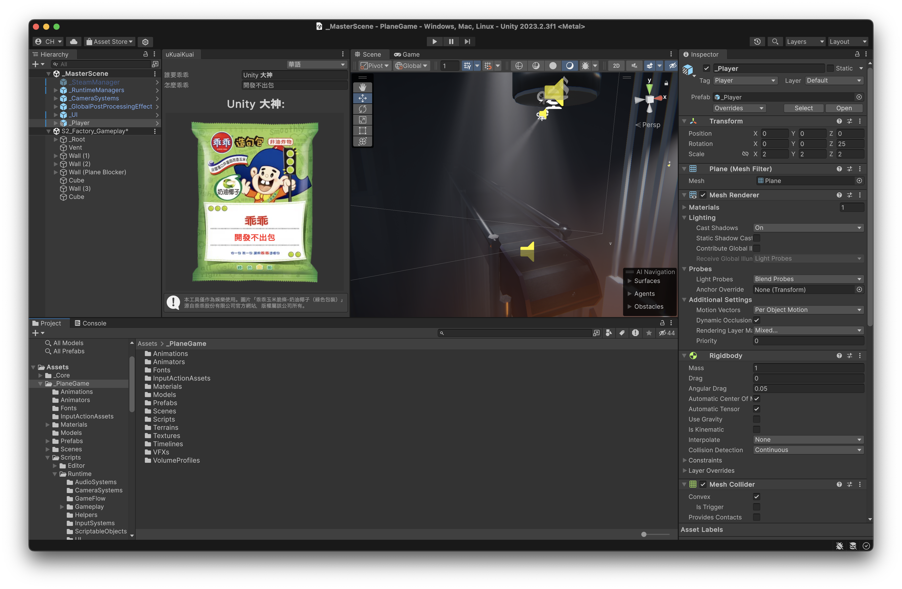

# uKuaiKuai

保佑 Unity 專案開發順利。

## 安裝方式與快速入門

以下有幾種安裝 uKuaiKuai 的方法：

### Unity Package Manager
- 在 Unity 中，選擇 Window > Package Manager。
- 在 Package Manager 視窗中，點選左上角的加號（＋）符號，並點選 Add package from git URL...。
- 貼上以下連結： `https://github.com/huchi57/uKuaiKuai.git` ，然後點選 Add。

### 直接下載
- 直接下載本專案，並放在 Unity 專案的 Asset 資料夾底下。
- 完成安裝以後，選擇 OwO > Window > uKuaiKuai 來開啟 uKuaiKuai 視窗。

## 版本
已在 Unity 2021.3 以上版本測試。

**（本工具僅作為娛樂使用。圖片「乖乖玉米脆條-奶油椰子（綠色包裝）」源自乖乖股份有限公司官方網站，版權屬該公司所有。）**
